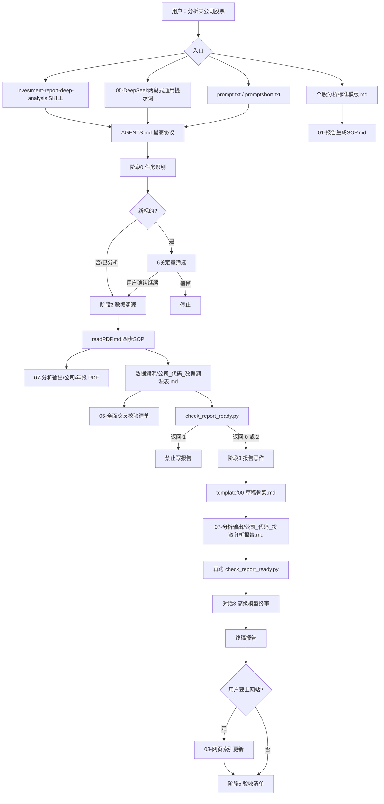
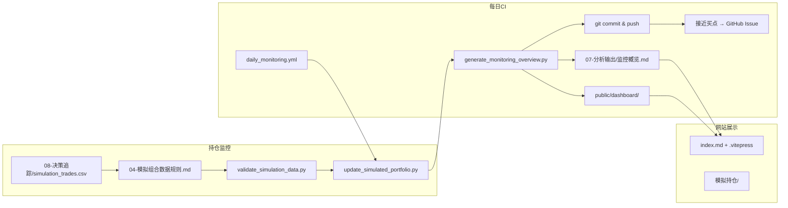
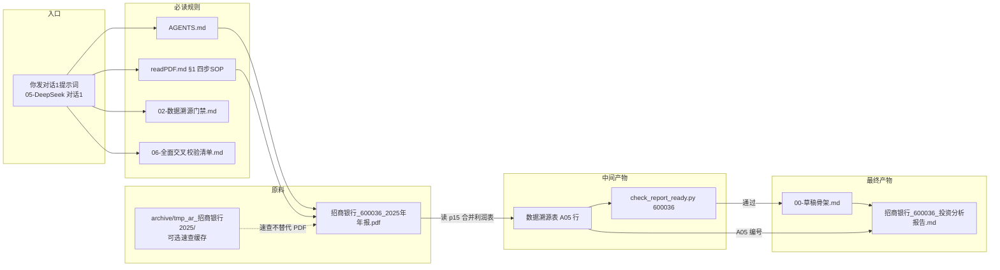

# 投资分析项目 · 工作流程全景图

> **版本**：V2.0 · 2026-06-06（对齐 AGENTS.md **V5.5.18**）
>
> **说明**：详细规则仍以 [`AGENTS.md`](../AGENTS.md) 及各 [`docs/ai-rules/`](ai-rules/) 长规范为准；**本文是全景导航**，整合原对话梳理 + Opus 审阅补充 + 四层校验更新 + 招商银行调用实例。

你的投资板块是一套 **「规则驱动 + 门禁脚本 + 多模型分工」** 的知识管理项目。下面从**人/AI 的入口**开始，按阶段说明**谁调用谁、每个文件干什么**。

---

## 一、总览：从你说一句话到产出报告



**铁律（贯穿全程）**：`AGENTS.md` 第一节 — 缺 PDF/页码/溯源表就停；核心数必须有来源；报告必须先过门禁。

**修正版一句话定位**（整合 Opus 审阅 + 茅台对话后的四层校验）：

> 这套系统 = **一条报告主链**（AGENTS → 6关 → 溯源表 → `check_report_ready` 门禁 → 两段式写作 → 终审）
> + **一个监控子系统**（trades.csv → `update_simulated_portfolio` / `generate_monitoring_overview` → 监控概览/dashboard，GitHub Actions 每日自动跑）
> + **两套校验**（报告门禁 `check_report_ready.py` / 配置化 `validate_data.py`）
> + **四层交叉校验**（勾稽 → 年报内部 → 外部 WS → 终审合理性）
> + **版本闭环**（CHANGELOG / 归档版本）

---

## 二、入口层：你从哪开始

| 入口文件 | 谁用 | 功能 | 下一步调用什么 |
|----------|------|------|----------------|
| **`AGENTS.md`** | 所有 AI Agent | 项目最高协议：门禁顺序、幻觉红线、目录地图、校验脚本 | 按任务类型读 `docs/ai-rules/*` |
| **`.claude/CLAUDE.md`** | Claude Code | `AGENTS.md` 的兼容入口，内容更短 | 同上 |
| **`个股分析标准模版.md`** | 你（人） | 分析框架导航：5分钟初筛 + 10章模板索引 | 链到 `template/01~10`、SOP |
| **`prompt.txt`** | 你复制给 DeepSeek | 某标的的**现成对话 0～3 提示词**（如中国平安） | 指向 AGENTS、readPDF、骨架 |
| **`promptshort.txt`** | 你复制给高级模型 | **极简终审口令**（一行指定报告+日期） | skill + 05 文档对话3 |
| **`docs/ai-rules/05-DeepSeek两段式通用提示词.md`** | 你分析**新标的**时用 | 带 `{占位符}` 的通用版对话 0/1/2/3 模板 | 同上，可复用 |
| **`.cursor/skills/investment-report-deep-analysis/SKILL.md`** | Cursor 自动触发 | 你说「分析某股/写报告」时 AI 必读；规定 DeepSeek 两段 + 高级终审 | AGENTS + 01 + 02 + **06** + readPDF + check脚本 |

**`数据溯源/入口链.txt`** 把溯源任务的阅读顺序画成链：

```
用户「做数据溯源」
  ↓
readPDF.md ← 唯一技术入口
  ├── §0 前置铁律
  ├── §1 四步 SOP（dump→提取→交叉验证→并行WS）
  ├── §2 页码范围 + 三级定位
  ├── §3 八条红线
  ├── §4 WebSearch 交叉验证（含 WS 年份分层）
  ├── §5~§8 科目缺失 / 验证口令 / 高危科目 / Python 代码
  └── 数据准确性保障流程.md ← 补充规范
      ├── 一 溯源表结构标准（A/B/C区 + WS列）
      ├── 二 行业特有科目
      ├── 三~五 无数据怎么处理 / 自检清单 / 抽查方法
  └── docs/ai-rules/02-数据溯源门禁.md + 06-全面交叉校验清单.md
```

---

## 三、阶段 0～1：要不要分析这只股

| 阶段 | 规范文件 | 功能 |
|------|----------|------|
| **0 任务识别** | `01-报告生成SOP.md` §阶段0 | 只是问答 → 不写报告；明确要求写报告 → 进阶段1 |
| **1 标的状态** | 同上 §阶段1 | 已有报告 → 读旧报告+溯源表判断要不要更新 |
| **1 新标的筛选** | 同上「6关定量筛选」 | 护城河/FCF质量/管理层/净现金/股息/估值 六关；**不通过就停** |
| **已分析清单** | `07-分析输出/index.md` | 哪些公司已做过报告（不另维护重复列表） |

对话 0 只在 `05-DeepSeek` / `prompt.txt` 里出现，**可选**；你确认「可以继续」才进对话 1。

---

## 四、阶段 2：数据溯源（最硬的门禁）

### 4.1 规范怎么串起来

| 文件 | 功能 | 何时被调用 |
|------|------|------------|
| **`readPDF.md`** | PDF 提取**唯一技术规范**：PyMuPDF、定位三大表、标页码、平衡验算、WebSearch 交叉验证、八条红线 | 对话1 / 提取核对任务**必读** |
| **`docs/ai-rules/02-数据溯源门禁.md`** | **能不能写报告**的判定标准（S级来源、WS列、勾稽、禁止 `—` 占位、验证汇总年份分层） | 对话1 必读；与脚本规则一致 |
| **`docs/ai-rules/06-全面交叉校验清单.md`** | **四层校验**、A/B/C 分级、分红结构完整性、终审合理性表 | 对话1 必读；对话3 终审对照 |
| **`数据溯源/数据准确性保障流程.md`** | 溯源表 **A/B/C 三区结构**、行业扩展科目、自检清单 | 建表时补充 readPDF |
| **`docs/ai-rules/99-错误案例库.md`** | 踩坑复盘（WebSearch 冒充年报、茅台股息率漏中期分红等） | 对话1 建议读案例6/7/8 |

### 4.2 原料与产出

| 路径 | 功能 |
|------|------|
| **`07-分析输出/{公司}/`** 或 **`07-分析输出/{公司}/年报/`** | 存放 **2021–2025 年报 PDF**（对话1 的数据源） |
| **`数据溯源/{公司}_{代码}_数据溯源表.md`** | **核心中间产物**：A区原文数+B区公式+C区市价；报告只能引用这里 |
| **`archive/tmp_ar_*`、`scripts/dumps/`、`temp/`** | 分析时的 **PDF 页文本 dump**（给 AI 速查，非正式交付物） |
| **`scripts/extract_*.py`、`dump_*.py`、`download_cninfo_*.py`** | 按标的写的**一次性提取/下载脚本**，不是主流程必经，是加速抠 PDF 的工具 |

### 4.3 门禁脚本（报告主链）

```bash
python scripts/check_report_ready.py {股票代码}
```

| 返回码 | 含义 |
|--------|------|
| **0** | 可写报告 |
| **2** | 可写但有 ⚠️，建议复核 |
| **1** | **禁止写报告**（🔴、缺页码、核心行 WS 不过、BS/CF 无 ✅、验证汇总年份分层违规等） |

脚本读 `数据溯源/*_数据溯源表.md`，写报告后还会再检查报告的 6 易漏小节、买入公式等。

### 4.4 四层交叉校验 + WS 年份分层（V5.5.18 定稿）

> 完整细则：`docs/ai-rules/06-全面交叉校验清单.md`（V1.1）

```
┌─────────────────────────────────────────────────────────────┐
│ 第1层 报表内部勾稽     BS/CF/PL 平衡、B区公式回算、0值确认   │ → 脚本阻断
├─────────────────────────────────────────────────────────────┤
│ 第2层 年报内部交叉     摘要↔正式表、分红章节↔p2、次年比较列  │ → 自检块 + 脚本警告
├─────────────────────────────────────────────────────────────┤
│ 第3层 外部独立源比对   WS 按年份分层（见下表）               │ → 验证汇总表 + 脚本
├─────────────────────────────────────────────────────────────┤
│ 第4层 报告终审合理性   报告↔溯源表 + 衍生指标市场合理性      │ → 高级模型验收记录
└─────────────────────────────────────────────────────────────┘
```

**禁止把「脚本返回 0」等同于「数据已全面验证」。** 第4层由对话3高级模型完成。

**A 类 · WS 年份分层**（须在溯源表末尾维护「WebSearch 验证汇总」表）：

| 年份 | 合格标记 | 不合格 |
|------|----------|--------|
| **2025** | ✅、📄（🔗 可过，建议改 ✅） | 📝、⚠️、空白 |
| **2022–2024** | ✅、🔗、📄 | 📝、⚠️、空白 |
| **2021** | 📝、✅、🔗、📄（**不要求 WebSearch**） | ⚠️、空白 |

---

## 五、阶段 3：报告写作（两段式 + 终审）

### 5.1 模型分工

| 对话 | 执行者 | 读什么 | 写什么 |
|------|--------|--------|--------|
| **对话0**（可选） | DeepSeek | AGENTS、01-SOP §6关 | 筛选结论（不写文件） |
| **对话1** | DeepSeek | AGENTS、readPDF、02门禁、**06**、99案例 | 只写 **溯源表** + 跑门禁 |
| **对话2** | DeepSeek | `template/00-草稿骨架.md`、01-SOP | 写 **报告草稿**（数字只引 A05 这类编号） |
| **对话3** | 高级模型 | skill、01-SOP、草稿+溯源表 | **终审**：对账、补「待查」、只改差章、第4层合理性 |

`promptshort.txt` 就是对话3 的极简版，例如指定某报告 + 股价日期做终审。

### 5.2 模板体系（两套，别混）

| 文件 | 角色 |
|------|------|
| **`template/00-草稿骨架.md`** | **AI 填草稿用的空壳**（18模块+6易漏小节，对话2 复制填空） |
| **`template/01~10-*.md`** | **深度分析方法论**（地缘政治、负债、估值、烟蒂股等）；人读或 AI 参考展开，不是直接复制成报告 |
| **`个股分析标准模版.md`** | 把 01～10 编成「完整分析流程表」的**导航页** |

### 5.3 正式产出

| 文件 | 功能 |
|------|------|
| **`07-分析输出/{公司}_{代码}_投资分析报告.md`** | **最终交付物**；同名覆盖，只留最新版 |
| 标题下 **`一句话结论`** | SOP 强制第一屏要有 |

---

## 六、阶段 4～5：网站与验收（可选/收尾）

| 文件 | 功能 | 何时调用 |
|------|------|----------|
| **`docs/ai-rules/03-网页索引更新.md`** | 报告要出现在 VitePress 网站时，改三处索引 | 仅当你提到网站/侧边栏 |
| **`07-分析输出/index.md`** | 分析输出目录（按行业列表） | 阶段4 之一 |
| **根目录 `index.md`** | 首页「最新分析报告」表 | 阶段4 之一 |
| **`.vitepress/config.mjs`** | 左侧栏链接 | 阶段4 之一 |
| **`scripts/check_index_sync.py`** | 检查三处索引是否一致 | 更新网站后可选跑 |

阶段5 验收清单在 `01-SOP` §阶段5：列报告路径、溯源表、PDF、门禁返回码、是否 git 等。

---

## 七、并行子系统（不是写报告主链，但同属投资板块）



### 7.1 核心路径与文件

| 路径/文件 | 功能 |
|-----------|------|
| **`08-决策追踪/`** | 模拟组合、AI 决策记录；`simulation_trades.csv` 是**唯一真相源** |
| **`docs/ai-rules/04-模拟组合数据规则.md`** | 改持仓前必读 |
| **`模拟持仓/`** | 网页展示：`持仓.md`、`今日操作.md`、`决策记录.md`、`index.md` |
| **`config/risk_management.yaml`** | 风控规则配置 |
| **`07-分析输出/监控概览.md`** | 每日监控一览（GitHub Actions 自动更新） |

### 7.2 每日 CI 链条（`daily_monitoring.yml`）

每个交易日 UTC **08:30 / 08:40**（双 cron 防漏触发）自动执行：

1. `python scripts/update_simulated_portfolio.py` — 按 trades.csv 更新模拟组合
2. `python scripts/generate_monitoring_overview.py` — 生成监控概览 + dashboard 快照
3. `git add` → `commit` → `push`（`07-分析输出/监控概览.md`、`08-决策追踪/`、`public/dashboard/`）
4. 接近买点时**自动开 GitHub Issue 提醒**

> **注意**：`AGENTS.md` 禁止 AI 自动 git；上述 CI 是**唯一合法例外**。

### 7.3 监控子系统常驻脚本（≠ 一次性 extract 脚本）

| 脚本 | 作用 |
|------|------|
| `update_simulated_portfolio.py` | 模拟组合自动决策 |
| `generate_monitoring_overview.py` | 生成监控概览 |
| `fetch_historical_prices.py` / `get_fenzhong_data.py` | 抓行情 |
| `fetch_vhsi.py` / `analyze_vix_thresholds.py` / `vix_ndx_backtest.py` | VHSI/VIX 情绪与阈值 |
| `sync_tracked_codes.py` | 同步监控标的代码 |
| `build_standalone_dashboard.py` | 生成 `public/dashboard/` 独立仪表盘 |
| `validate_simulation_data.py` | 模拟组合数据一致性 |

### 7.4 dashboard 产物链

| 路径 | 功能 |
|------|------|
| `public/dashboard/dashboard_snapshot.json` | 仪表盘快照 |
| `public/risk-data.json`、`public/risk-dashboard.html` | 风险数据展示 |
| `08-决策追踪/dashboard_snapshot.json`、`simulation_state.json` | 组合状态持久化 |

### 7.5 双校验体系

| 维度 | `check_report_ready.py` | `validate_data.py` |
|------|-------------------------|-------------------|
| **定位** | **报告主链门禁**（当前主力，V5.5.18） | 配置化数据硬校验（按标的 YAML） |
| **输入** | `数据溯源/*_数据溯源表.md`（+ 报告复检） | `config/validation/{公司}_{代码}_*.yaml` |
| **配置** | 规则内嵌脚本 | `config/data_validation_template.yaml`、`config/risk_management.yaml` |
| **何时跑** | 对话1 后**必跑**；对话2 后再跑 | 早期标的或需要 YAML 契约时（非每标的必经） |

```bash
python scripts/check_report_ready.py {股票代码}          # 报告主链必跑
python scripts/validate_data.py config/validation/...   # 按需
```

---

## 八、按「文件类型」一张总表

| 类型 | 代表文件 | 一句话功能 |
|------|----------|------------|
| **协议入口** | `AGENTS.md` | AI 最高优先级规则（V5.5.18） |
| **阶段 SOP** | `docs/ai-rules/01~06、99` | 写报告/溯源/网站/组合/DeepSeek提示词/四层校验/错误库 |
| **PDF 技术** | `readPDF.md` | 怎么从 PDF 抠数、验算、标 WS |
| **表结构** | `数据溯源/数据准确性保障流程.md` | 溯源表 A/B/C 怎么填 |
| **溯源入口链** | `数据溯源/入口链.txt` | 做溯源时读什么（简图） |
| **人读导航** | `个股分析标准模版.md` | 投资框架总目录 |
| **章节框架** | `template/01~10` | 各章分析方法论 |
| **AI 草稿壳** | `template/00-草稿骨架.md` | DeepSeek 填空写报告 |
| **可复制提示词** | `prompt.txt`、`05-DeepSeek两段式` | 对话 0～3 口令 |
| **Skill** | `.cursor/skills/.../SKILL.md` | Cursor 自动加载的深度分析流程 |
| **原料** | `07-分析输出/**/年报*.pdf` | S 级数据源 |
| **中间产物** | `数据溯源/*_数据溯源表.md` | 数字唯一可信来源 |
| **最终产物** | `07-分析输出/*_投资分析报告.md` | 投资分析报告（**同名覆盖，只留最新**） |
| **报告门禁** | `scripts/check_report_ready.py` | 溯源表+报告能不能过关 |
| **配置化校验** | `scripts/validate_data.py` + `config/validation/` | 按 YAML 做数据硬校验 |
| **临时 dump** | `archive/tmp_ar_*`、`scripts/dumps/` | AI 速查 PDF 原文，非正式 |
| **一次性脚本** | `scripts/extract_*`、`download_cninfo_*` | 某标的 PDF 批量提取/下载 |
| **监控常驻脚本** | `update_simulated_portfolio` 等 | 每日 CI / 行情 / dashboard |
| **网站** | `index.md`、`.vitepress/` | Markdown 渲染成站 |
| **版本史** | `docs/CHANGELOG.md`、`归档版本/` | **模板**版本演进（公司报告不版本后缀） |

### 版本管理闭环

- **模板文件**：改版 → 旧版进 `归档版本/` → 记入 `docs/CHANGELOG.md`
- **公司报告**：`{公司}_{代码}_投资分析报告.md` **不做版本后缀**，同名直接覆盖

### Skill 多份副本提醒

同名 skill 可能存在于 `.cursor/skills/`、`~/.cursor/skills/`、`~/.claude/skills/` 等多处；内容若不同步会导致不同环境行为不一致，改版时注意对齐。

---

## 九、你日常最简用法（记住 4 个名字就够）

1. **想分析新股** → 打开 `05-DeepSeek两段式通用提示词.md`，替换占位符，按对话 0→1→2→3 发
2. **只想终审** → `promptshort.txt` 改公司名和日期
3. **查数字从哪来** → `数据溯源/{公司}_{代码}_数据溯源表.md`
4. **查结论** → `07-分析输出/{公司}_{代码}_投资分析报告.md`

中间 `readPDF.md`、门禁脚本、骨架模板都由 AI 按 `AGENTS.md` 自动去读，**你不用背路径**。

---

## 十、审阅补充（Opus 对初版梳理的评价）

### 10.1 总体评价

初版梳理 **主干准确、结构清晰**，把「入口 → 6关筛选 → 溯源门禁 → 两段式写作 → 终审 → 网站/验收」这条**报告生成主链**讲对了，文件职责归类也基本到位。

偏重「写报告」主链，对监控/模拟组合自动化、双校验、dashboard 产物链讲得偏浅——**已在本文第七、八节补全**。

### 10.2 初版需修正的不准确点（及当前状态）

| 问题 | 说明 | 当前状态 |
|------|------|----------|
| 版本号自相矛盾 | 初版时 `AGENTS.md` 头部 V5.5.16、正文 V5.5.14 冲突 | ✅ **已统一为 V5.5.18** |
| 监控脚本当「可选项」 | `update_simulated_portfolio` 实为每日 CI 自动跑 | ✅ 见 §7.2 |
| 缺四层校验 | 茅台股息率案例后新增 `06-全面交叉校验清单.md` | ✅ 见 §4.4 |

### 10.3 初版讲对、值得保留的部分

- 报告主链阶段门禁顺序、返回码 0/1/2 语义 ✅
- 两段式 + 终审模型分工（对话 0/1/2/3）✅
- `00-草稿骨架`（AI 填空壳）与 `01~10`（方法论）**两套模板别混** ✅
- 「中间产物=溯源表、最终产物=报告、数字只能引溯源表编号」✅
- `数据溯源/入口链.txt` 的溯源阅读链 ✅

---

## 十一、招商银行（600036）调用实例

下面用 **招商银行** 画「真实调用」——从 PDF、溯源表、报告、归档 tmp 怎么串起来。

### 11.1 全景：一条数字的完整旅程（A05 归母净利润）



### 11.2 实例 1：核心财务数字（最典型路径）

| 步骤 | 文件 | 发生了什么 |
|------|------|------------|
| **① 定位 PDF** | `07-分析输出/招商银行/招商银行_600036_2025年年报_2026-03-27.pdf` | 搜「合并利润表」→ **p15** 为 2025 年合并 PL 首页 |
| **② 提取原文** | 同上 PDF p15 | 「归属于本行股东的净利润」≈ 150,181 百万元 |
| **③ 换算入表** | `数据溯源/招商银行_600036_数据溯源表.md` **A05** | ÷100 → **1,501.81 亿元**；`2025AR p15`；WS ✅ |
| **④ 门禁校验** | `python scripts/check_report_ready.py 600036` | A05 五年有值、有页码、WS 合格 |
| **⑤ 报告引用** | `07-分析输出/招商银行_600036_投资分析报告.md` §盈利质量 | 写 `1,501.81`，末列标 **`A05`** |

溯源表 A05：

```text
# 数据溯源/招商银行_600036_数据溯源表.md 第37行
| A05 | 归母净利润 | 1,199.22 | 1,380.12 | 1,466.02 | 1,483.91 | 1,501.81 | 2022AR p17; 2023AR p16; 2024AR p15; 2025AR p15 | ✅ |
```

报告引用：

```text
# 07-分析输出/招商银行_600036_投资分析报告.md 第117行
| 归母净利润（亿） | 1,501.81 | 1,483.91 | 1,466.02 | 1,380.12 | 1,199.22 | A05 |
```

### 11.3 实例 2：受限资金（易漏小节 + tmp 角色）

**归档 tmp 是辅助，PDF 才是 S 级来源。**

| 步骤 | 文件 | 内容 |
|------|------|------|
| ① 规则要求 | `02-数据溯源门禁.md` + `00-草稿骨架.md` | 必须查附注「受限/法定存款准备金」 |
| ② 关键词搜页 | `archive/tmp_ar_招商银行2025/tmp_restricted.txt` | 搜「质押」「法定存款准备金」→ 定位 p285 等 |
| ③ 回 PDF 取数 | 2025年报 **p169、p285** | p169：法定存款准备金 502,368 百万元 |
| ④ 写入报告 | 报告 §受限资金 | 5,023.68 亿，标注 **`2025AR p169`** |

### 11.4 实例 3：衍生指标（B 区公式链）

**存贷比 LDR 73.8%**：

```
PDF p16 → A09 贷款 72,580.58 亿 + A12 存款 98,361.30 亿
         ↓
溯源表 B14 = A09÷A12 = 73.8%
         ↓
报告 §负债安全表：存贷比 73.8% | B14
```

### 11.5 实例 4：市场数据（C 区混合）

**股息率** = 年报 S 级（A22 每股分红）+ 外部 C 级（C01 股价）→ B01 或报告终审重算。分红来自 PDF，股价来自外部，**不得混淆**。

### 11.6 实例 5：定性章节（页码直引）

**两职合一**：`2025AR p84-85`「董事、监事和高级管理人员」→ 报告 §治理写「两职合一：否」。可用 `tmp_ar_p84.txt` 速查，但报告引用 **p84-85** 而非 tmp 路径。

### 11.7 按对话阶段看文件调用顺序

```
对话 0（可选）
  读：AGENTS.md + 01-SOP §6关
  产出：筛选结论（不写文件）

对话 1（DeepSeek · 只做溯源）                    ← 最关键
  读：readPDF.md + 02门禁 + 06 + 99案例
  读：07-分析输出/招商银行/*.pdf（2021-2025 共5份）
  辅：archive/tmp_ar_*（按需）
  写：数据溯源/招商银行_600036_数据溯源表.md
  跑：python scripts/check_report_ready.py 600036
  停：返回 1 则不打对话 2

对话 2（DeepSeek · 草稿）
  读：template/00-草稿骨架.md + 已通过门禁的溯源表
  写：07-分析输出/招商银行_600036_投资分析报告.md（草稿）
  数字规则：只写 A05、B14、A22 等编号，或已标注的 p169
  再跑：check_report_ready.py（查 6 易漏小节、买入公式）

对话 3（高级模型 · 终审）
  读：草稿 + 溯源表 + skill
  改：只改不合格章；第4层合理性交叉校验
  产出：同名报告覆盖为终稿
```

### 11.8 招商银行关键字段去哪查

| 你想查什么 | 第一优先 | 第二优先（辅助） |
|------------|----------|------------------|
| 归母净利润五年 | 溯源表 **A05** | PDF 2025AR p15 |
| 不良率 / ROE | 溯源表 **A16/A19** | 各年摘要页 |
| 股息 / 分红率 | 溯源表 **A22/B18** | PDF 2025AR p102 |
| 受限/法定准备金 | 报告 §受限资金 + **p169/p285** | `archive/.../tmp_restricted.txt` |
| 董事长/行长 | 报告 §治理 + **p84-85** | `archive/.../tmp_ar_p84.txt` |
| 估值 PE/PB | 溯源表 **B02/B03** | C01 股价 + A06/A15 |
| 能不能写报告 | `check_report_ready.py 600036` | — |

### 11.9 口诀

> **PDF 抠数 → 溯源表编号 → 门禁脚本 → 报告引编号 → tmp 只是速查**

---

## 十二、规范文件索引（01～06 + 99）

| 文件 | 职责 |
|------|------|
| `01-报告生成SOP.md` | 阶段 0～5、6关筛选、深度模块清单、6易漏小节 |
| `02-数据溯源门禁.md` | 能不能写报告；WS、勾稽、验证汇总年份分层 |
| `03-网页索引更新.md` | VitePress 三处索引同步 |
| `04-模拟组合数据规则.md` | 改持仓 / 决策追踪前必读 |
| `05-DeepSeek两段式通用提示词.md` | 对话 0/1/2/3 可复制模板 |
| `06-全面交叉校验清单.md` | 四层校验、A/B/C 分级、分红结构、终审合理性表 |
| `99-错误案例库.md` | 踩坑复盘 |

---

*全景图 V2.0 · 2026-06-06 · 上位规则 AGENTS.md V5.5.18*
